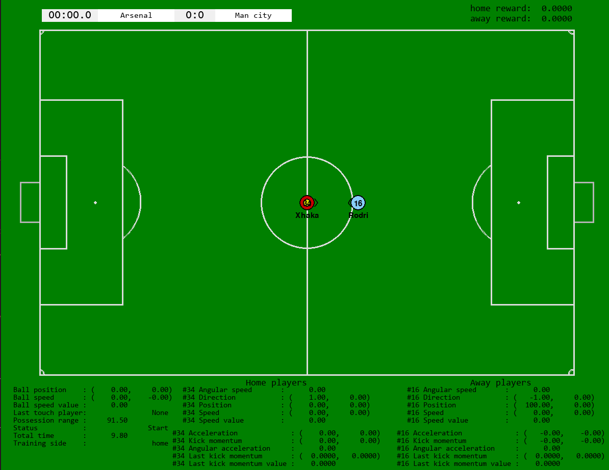

# Football2D
### Introduction

This is a 2D Football Gym Reinforcement Learning Environment. The goal of this project is to explore what reinforcement learning can offer to football tactics. The project is **ongoing**. Right now I have implemented a self-training environment and a one-on-one football environment. Down below is a screen shot of the one-on-one football environment.

#### Environment Setting

The state of the game is updated every 0.02 seconds.

##### Field

- The size of the field is $1050 \times 680$. Each position can be expressed in a 2d coordinate. 
- The center of the field is $(0, 0)$.

##### Ball

- Has two resistance force. One is proportional to the square of the speed; the other is a constant.
- Will be fixed on the border if it is out of the field.
- Can be kicked or rebounded from a player.

##### Player

- The move action is a 2d acceleration.
- The kick action is a 2d momentum exerted on the ball.
- Has a facing direction. The turning action is a 1d angular acceleration.
- Has a maximum speed and a maximum acceleration.
- Has a maximum angular speed and a maximum angular acceleration.
- Has a maximum kicking power.
- Has a uncertainty when kicking the ball. 
- Kicks more accurately in slower speed and less force.
- Moves faster towards the facing direction. 
- Kicks more accurately towards the facing direction.

##### Law of the game

- Restart from the center when a goal is scored.
- Has limited game duration.

### Requirements

- PyTorch
- OpenAI Gym
- Pymunk

